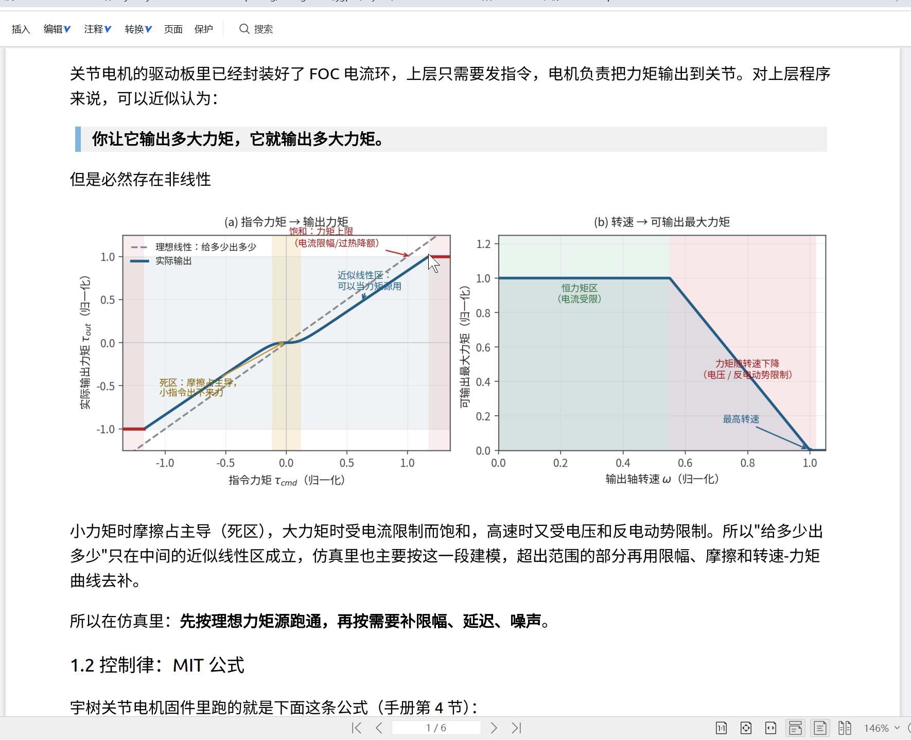
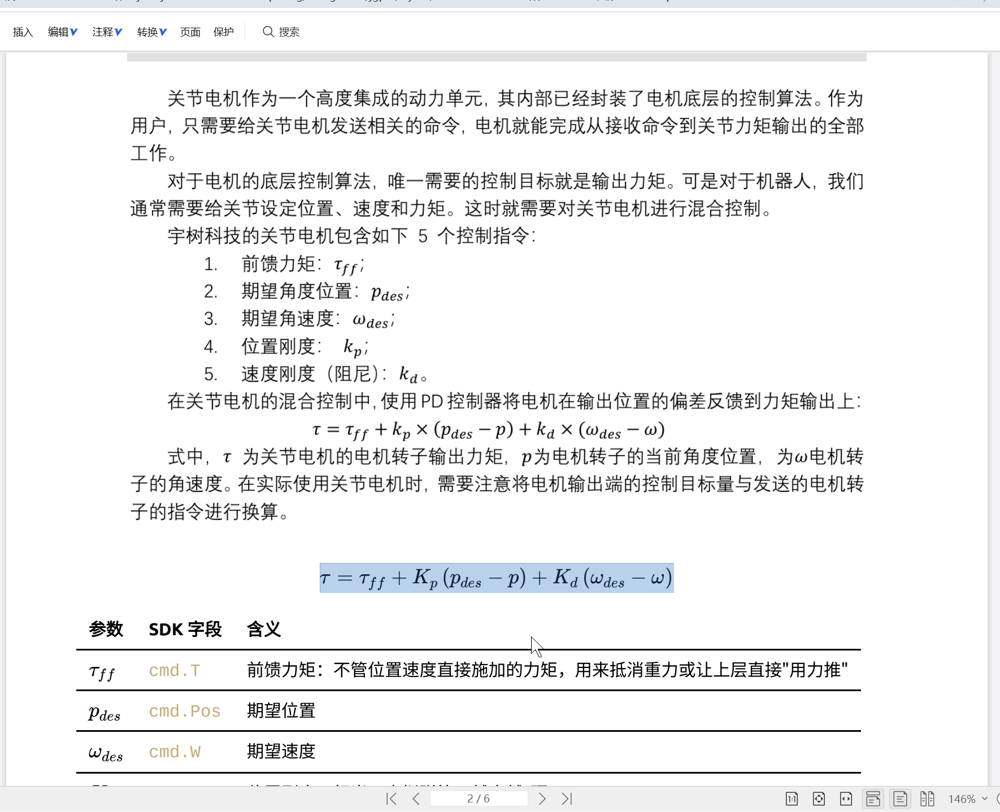
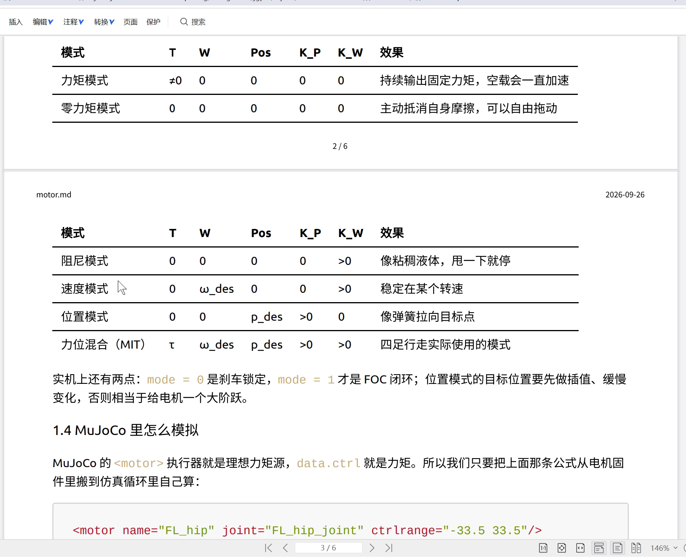
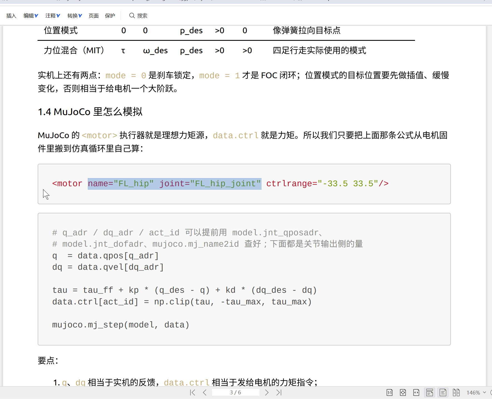
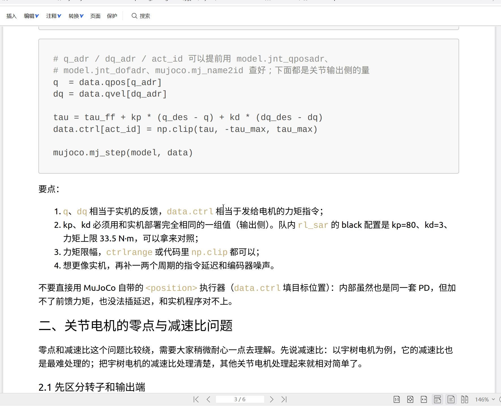

# 视频 1：关节电机、PD 与 MuJoCo

这份文字稿按视频顺序整理。讲者原本的讲解仍是主体；在几个容易断开的地方补了“学习连接”，把视频内容接回第二次培训的 MuJoCo 代码。

先记住这一段视频走的是一条很短的链：

```text
当前关节状态 q / dq
        ↓
P / PD / 前馈
        ↓
得到力矩 tau
        ↓
MuJoCo motor actuator / data.ctrl
```

真实电机里的转子、减速器和编码器在视频 2 再展开。

## 00:00–04:03　先把关节电机看成力矩源

这次先讲关节电机的特性。讲者先给出一个工作近似：**关节电机可以先看成力矩源**。电机内部可能用了 FOC 等算法，这里暂时把内部细节压成一个黑箱：给它设定力矩，它输出一个接近设定值的力矩。

讲者指着第一张曲线解释，横轴是指令力矩，纵轴是实际输出力矩，整体接近 $y=x$。小力矩时，摩擦等因素可能让指令力矩体现不出来；指令过大时，又会碰到力矩、电流的上限。


*02:00：指令力矩与实际输出力矩，以及转速和力矩的关系*

旁边的图说明输出力矩还与转速有关：转速和大力矩不能无限同时提高。现阶段做仿真时，先把关节电机当成理想力矩源；以后要研究实机差异，再逐步考虑摩擦、延迟、噪声和限幅。

### 学习连接：这和第二次的 `ctrl` 是什么关系

第二次培训里已经写过：

```python
data.ctrl[actuator_id] = tau
mujoco.mj_step(model, data)
```

当 MJCF 使用简单的 `<motor>` actuator 时，第三次开始把这里的 `tau` 明确解释成“这一时刻希望施加的驱动力矩”。所以视频后面所有控制公式，最后都会落到这个 `tau` 上。

## 04:04–06:06　五个命令量进入同一条控制式

知道电机最终近似输出力矩以后，下一步就是：**这个力矩从哪里来？**

讲者把画面上的控制方式称为 MIT 协议。命令包含五个量：

- 期望位置 $p_{des}$；
- 期望角速度 $\omega_{des}$；
- 位置增益 $K_p$；
- 速度增益 $K_d$；
- 前馈力矩 $\tau_{ff}$。

电机读取当前位置 $p$、当前角速度 $\omega$，再按公式计算期望力矩：

$$
\tau
=
\tau_{ff}
+K_p(p_{des}-p)
+K_d(\omega_{des}-\omega).
$$


*05:20：五个命令量和力矩计算公式*

讲者把整个过程分成两层：

```text
五个命令量
    ↓
控制公式
    ↓
期望力矩 tau
    ↓
电机近似按这个力矩输出
```

视频 2 才会继续说明，这里的 $p$、$\omega$ 在实际电机接口里讨论的是转子侧量；上层真正关心的机器人关节角还要经过减速器换算。

## 06:07–08:11　把公式拆开看

先只保留前馈力矩。令 $K_p=0$、$K_d=0$：

$$
\tau=\tau_{ff}.
$$

此时给多少前馈力矩，公式就得到多少期望力矩。

再令 $K_d=0$、$\tau_{ff}=0$：

$$
\tau=K_p(p_{des}-p).
$$

这里的位置误差越大，产生的回复力矩越大。讲者把它称为位置 P 控制，目标是让电机靠近设定位置。

反过来，令 $K_p=0$、$\tau_{ff}=0$：

$$
\tau=K_d(\omega_{des}-\omega).
$$

这时控制量来自速度误差。讲者说可以把它理解成速度的 P 控制。

## 08:12–11:43　PD、阻尼和“弹簧＋阻尼器”

把位置项和速度项同时保留，就是视频里主要使用的 PD：

$$
\tau
=
K_p(p_{des}-p)
+K_d(\omega_{des}-\omega).
$$

讲者有时口头上会用“PID”泛指这一类控制；画面公式本身没有积分项。

若再令目标速度 $\omega_{des}=0$：

$$
\tau
=
K_p(p_{des}-p)-K_d\omega.
$$

位置项像弹簧一样把系统拉回目标位置；速度项和当前运动方向相反，形成阻尼。讲者用这个解释为什么单独的位置项容易在目标附近来回振荡，而加入速度项后会收敛得更稳一些。

这一段可以直接和大学物理里的二阶转动系统联系起来。最简单地写：

$$
I\ddot q=\sum \tau.
$$

控制器每一时刻都根据当前位置和速度重新算力矩，力矩再改变后续的角速度和角度。

## 11:44–13:39　各种“模式”其实是在选哪些项生效

讲者接着看画面上的模式表。

- **力矩模式**：只给非零前馈力矩；
- **零力矩模式**：几个命令量都置零；
- **阻尼模式**：保留 $K_d$，目标速度取 0，此时 $\tau=-K_d\omega$；
- **速度模式**：主要利用速度误差项；
- **位置模式**：主要利用位置误差项；
- **混合控制 / MIT 模式**：位置、速度和前馈可以一起使用。

阻尼模式下，转得越快，反向力矩越大。讲者举四足机器人“瘫软”在地上的例子：所有关节都只保留阻尼项，就会得到这种状态。


*12:10：力矩、零力矩、阻尼、速度、位置和混合模式表*

这里不需要把六种模式记成六套独立算法。它们都来自同一条控制式，只是把不同输入设成零或保留。

## 13:40–15:55　把控制式重新接回 MuJoCo

讲者回到上一轮培训的 URDF → MJCF。想给某个关节施加力矩，需要在 MJCF 中配置对应的执行器。画面举的是髋关节的 `<motor>`：

```xml
<motor
    name="..."
    joint="..."
    ctrlrange="..."
/>
```


*15:10：MuJoCo 的 `<motor>` 执行器示例*

这时 `<motor>` 承担的角色很清楚：**程序先自己算出力矩，再把结果交给 actuator。**

因此第二次留下来的控制循环被补成：

```text
qpos / qvel
    ↓
得到当前 q / dq
    ↓
P / PD / 前馈公式
    ↓
tau
    ↓
data.ctrl
    ↓
mj_step
```

## 15:56–18:00　代码画面：公式到底落在哪几行

画面中的代码从 `data.qpos`、`data.qvel` 读取关节位置和速度，根据目标值和增益算 `tau`，再用 `np.clip` 做力矩限幅，写入 `data.ctrl`，最后调用：

```python
mujoco.mj_step(model, data)
```


*16:35：读取关节状态、计算力矩并推进仿真的代码*

把程序抽掉具体下标以后，核心就是：

```python
q = ...      # 从 qpos 取当前关节角
dq = ...     # 从 qvel 取当前关节角速度

tau = (
    tau_ff
    + kp * (q_des - q)
    + kd * (dq_des - dq)
)

tau = np.clip(tau, tau_min, tau_max)
data.ctrl[actuator_id] = tau
```

讲者最后特别提到，这一培训路径希望使用 `<motor>` 并在程序里显式计算控制律，而不直接换成 MuJoCo 自带的 `<position>` actuator。这样后面迁移到真实关节电机时，控制程序中的位置、速度和力矩关系仍然看得见。

## 这一段结束后应该连上的三层

```text
理论：
误差 → P / PD / 前馈 → 力矩

代码：
qpos / qvel → tau → ctrl → mj_step

机械：
这一段先把电机压成“受控力矩源”
下一段再展开转子、减速器和编码器
```

接下来读 [视频 2](./02_视频文字稿.md) 时，重点会从“力矩怎样算”转到“上层的关节角和电机内部的转子角为什么不是同一个量”。