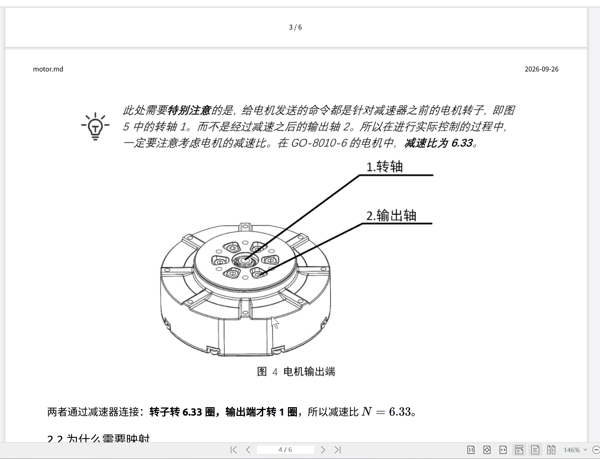
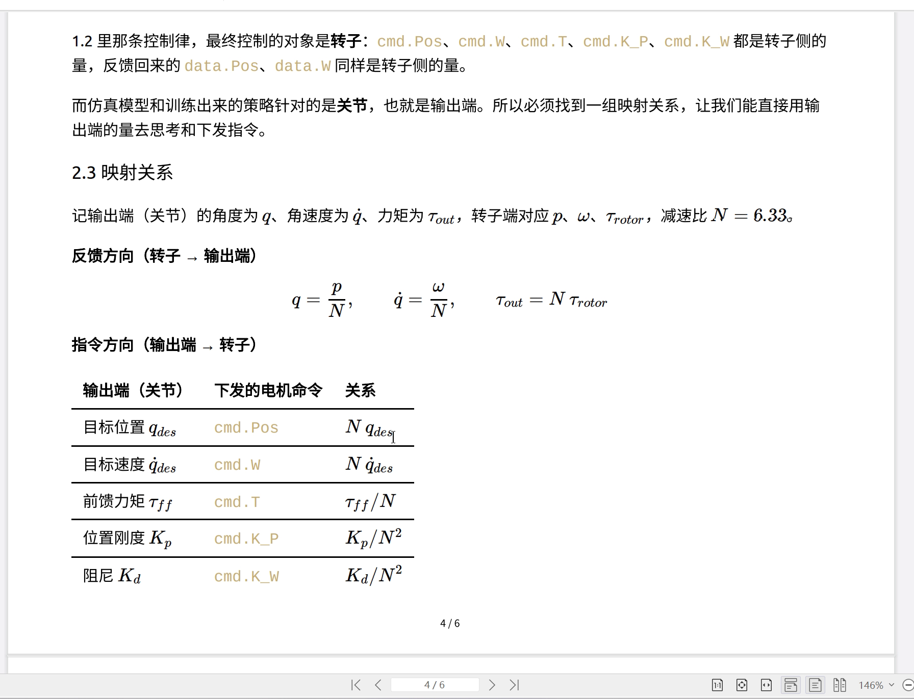
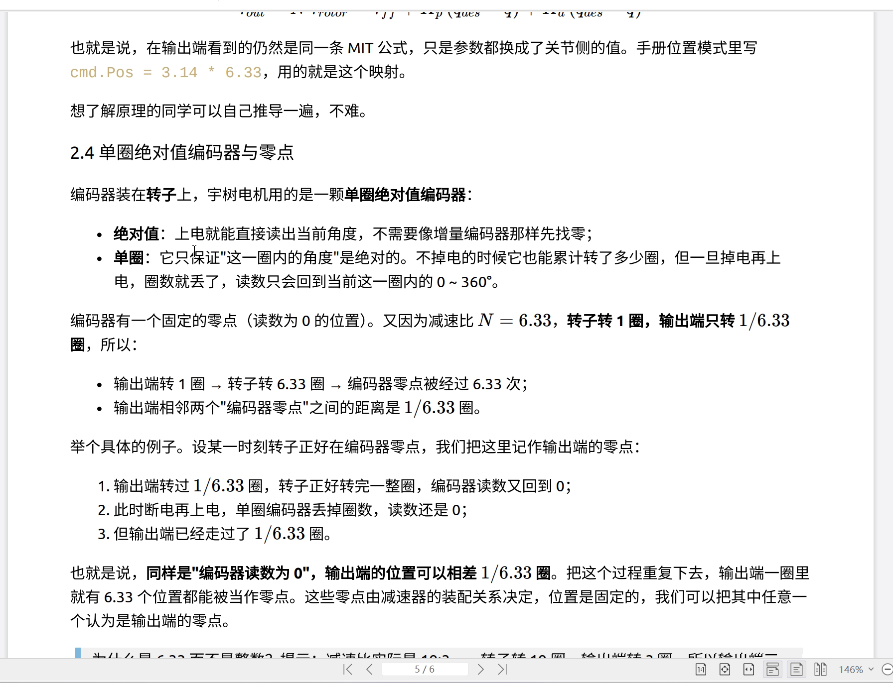
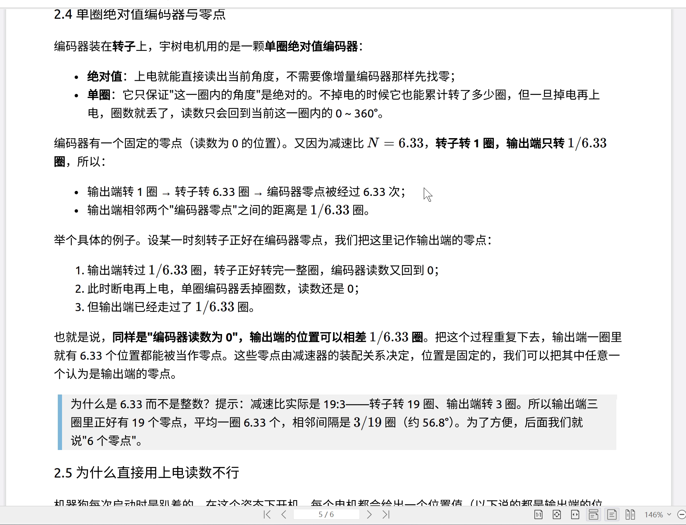
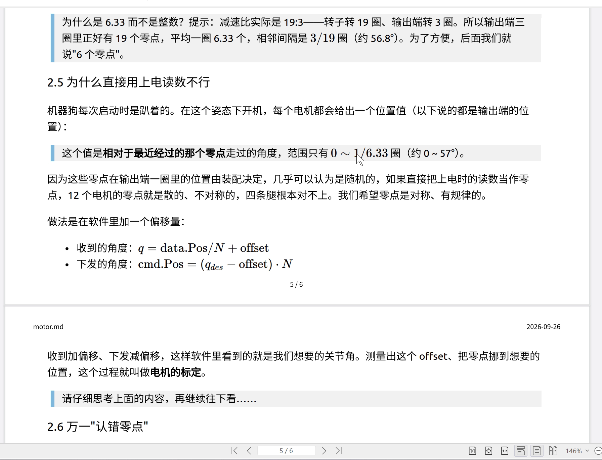
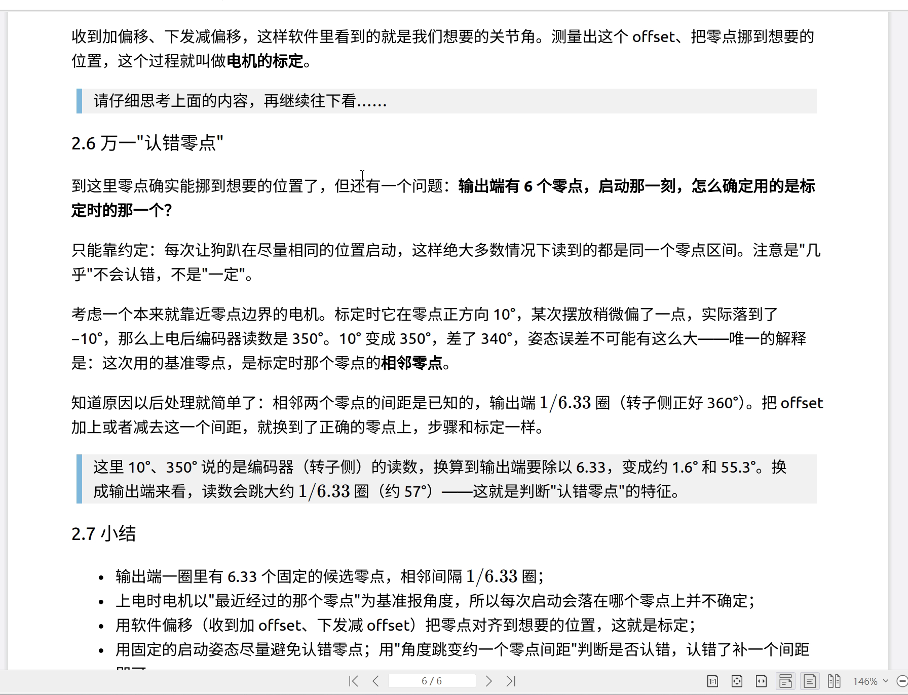

# 减速器、编码器与关节坐标

上一篇把 MuJoCo 里的 `qpos / qvel / ctrl` 接到了关节控制：程序读取关节角和角速度，用 PD 等控制律算出力矩，再把力矩交给 actuator。

真实四足机器人的关节又多了一层机械结构。腿并不是直接装在电机转子上，电机和关节之间有减速器；编码器也首先测到电机内部的转子角。于是同一个关节同时会出现两套位置、速度和力矩：

```text
机器人控制关心的量
q, dq, tau_joint
        │
        │ 减速器
        ▼
电机内部的量
p, omega, tau_motor
        │
        │ 编码器 / 电机驱动器
        ▼
SDK 读写的状态和命令
```

第三次视频第二段的大部分内容都在处理这三层之间的变换。

## 1. 先看清真实关节的机械结构

视频用宇树关节电机举例。结构上可以先抓住两个部位：

- **转子侧**：电机内部高速旋转的一侧；
- **输出端**：减速器外侧的输出法兰，腿部机构连接在这里。


*视频中的关节电机结构图：内侧转子与外侧输出端*

电机转子本身适合高速旋转，输出力矩相对较小；四足机器人的腿需要更大的关节力矩、较低的转速。减速器把这两端连接起来：转子转很多圈，输出端只转一圈，同时把输出端的力矩放大。

视频以约 $6.33:1$ 的减速比讲解，也就是转子约转 6.33 圈，输出端转一圈。原 `motor.pdf` 还给出了 $19:3$ 的写法。下面统一用符号 $N$ 表示减速比，推导与具体数值无关。

定义：

- $p$：转子角度；
- $\omega$：转子角速度；
- $\tau_m$：转子侧力矩；
- $q$：输出端，也就是机器人关节角；
- $\dot q$：关节角速度；
- $\tau_j$：关节侧力矩；
- $N$：转子转速与输出端转速之比。

先忽略不同关节安装方向带来的正负号。

## 2. 位置和速度为什么乘减速比

减速比定义已经给出：转子转 $N$ 圈，输出端转一圈。因此：

$$
p=Nq.
$$

若希望关节输出端到达目标角 $q_{des}$，电机转子需要到：

$$
p_{des}=Nq_{des}.
$$

角速度同理：

$$
\omega=N\dot q.
$$

所以从关节侧向转子侧发送位置和速度目标时，都要乘 $N$。


*视频中的输出端与转子侧位置、速度、力矩及增益换算表*

例如 $N=6.33$，关节输出端希望转 30°，转子目标角约为：

$$
30^\circ\times 6.33=189.9^\circ.
$$

这就是为什么实际电机 SDK 里看到的位置数字，不能直接当作机器人腿的关节角。

## 3. 力矩为什么反过来除减速比

位置和速度在转子侧更大，力矩关系正好相反。

忽略减速器损耗时，两侧机械功率近似相同：

$$
\tau_m\omega=\tau_j\dot q.
$$

又因为：

$$
\omega=N\dot q,
$$

代入得到：

$$
\tau_j=N\tau_m.
$$

也就是说，减速器把转子侧力矩放大 $N$ 倍到输出端。反过来，如果上层希望关节获得力矩 $\tau_j$，转子侧需要给出的力矩是：

$$
\tau_m=\frac{\tau_j}{N}.
$$

因此从关节侧目标转换成转子侧命令时，可以先记住三条：

| 关节侧目标 | 转子侧命令 |
|---|---|
| $q_{des}$ | $p_{des}=Nq_{des}$ |
| $\dot q_{des}$ | $\omega_{des}=N\dot q_{des}$ |
| $\tau_j$ | $\tau_m=\tau_j/N$ |

这三条来自同一个减速器关系，不需要分别记忆。

## 4. 为什么 $K_p$、$K_d$ 会出现 $N^2$

视频表格还直接给出了：

$$
K_{p,m}=\frac{K_{p,j}}{N^2},\qquad
K_{d,m}=\frac{K_{d,j}}{N^2}.
$$

原视频没有展开中间推导。把上一篇的 PD 和减速器关系接起来，就能得到它。

先只看位置项。假设我们希望在关节侧得到：

$$
\tau_j=K_{p,j}(q_{des}-q).
$$

电机内部却按转子侧角度误差计算：

$$
\tau_m=K_{p,m}(p_{des}-p).
$$

转子角误差比关节角误差大 $N$ 倍：

$$
p_{des}-p=N(q_{des}-q).
$$

同时，转子侧力矩经过减速器以后又会放大 $N$ 倍：

$$
\tau_j=N\tau_m.
$$

两式合起来：

$$
\tau_j
=N K_{p,m}(p_{des}-p)
=N^2K_{p,m}(q_{des}-q).
$$

要让它等于我们原本想要的

$$
K_{p,j}(q_{des}-q),
$$

就必须有：

$$
K_{p,m}=\frac{K_{p,j}}{N^2}.
$$

速度项完全相同：转子速度误差先乘一次 $N$，转子力矩经过减速器又乘一次 $N$，所以：

$$
K_{d,m}=\frac{K_{d,j}}{N^2}.
$$

这里的平方来自两个机械变换叠在一起，并不是额外的一条经验公式。

## 5. 代码里要明确区分关节侧和电机侧

到这里已经能看出，真实电机控制至少需要两套变量。

上层控制器更适合一直使用机器人关节语义：

```text
q        关节角
dq       关节角速度
q_des    目标关节角
dq_des   目标关节角速度
tau_ff   关节侧前馈力矩
Kp, Kd   关节侧控制增益
```

靠近 SDK 的电机接口层再负责转换成：

```text
p_des
omega_des
tau_motor
Kp_motor
Kd_motor
```

例如：

```python
def joint_command_to_motor(cmd, ratio):
    return {
        "p_des": ratio * cmd.q_des,
        "w_des": ratio * cmd.dq_des,
        "tau_ff": cmd.tau_ff / ratio,
        "kp": cmd.kp / (ratio * ratio),
        "kd": cmd.kd / (ratio * ratio),
    }
```

这段代码表达的就是视频表格中的五个换算。以后更换减速比时，上层站立状态、步态目标和 PD 逻辑都可以继续使用关节侧变量。

## 6. 编码器首先测到的是转子角

减速器解释了命令为什么需要换算，编码器则解释了反馈为什么也需要换算。

视频讨论的是安装在转子侧的单圈绝对值编码器。它首先给出转子相对于编码器自身零点的角度。


*视频中的单圈绝对值编码器示意*

如果暂时忽略零位，转子角与关节角的关系仍然是：

$$
q=\frac{p}{N}.
$$

因此 SDK 读回一个电机位置以后，程序不能把它原封不动交给上层控制器。需要先经过电机接口层，把转子侧位置和速度换成关节侧位置和速度。

反馈方向可以先写成：

```text
SDK / encoder
p, omega
    ↓ 除以 N
q, dq
    ↓
上层关节控制
```

到这里还没有处理零位和单圈信息，只完成了减速比换算。

## 7. “单圈绝对值”到底保存了什么

“绝对值”表示编码器在当前一圈内有固定参考零点；“单圈”表示掉电再上电以后，只能从传感器恢复这一圈里的位置，之前累计经过多少整圈不会保留下来。

如果转子真实角度为 380°，单圈位置只剩：

```text
20°
```

用数学形式表示：

$$
p_{raw}=p\bmod 2\pi.
$$

真实转子角可能是：

$$
p=p_{raw}+2k\pi,
$$

其中整数 $k$ 表示累计的整圈数。

这个 $k$ 对普通直连单圈轴可能没有那么显眼，但在减速器后面会直接变成不同的关节位置。

## 8. 为什么会出现多个候选关节位置

把

$$
p=p_{raw}+2k\pi
$$

代入减速比关系：

$$
q_k=\frac{p_{raw}+2k\pi}{N}.
$$

相邻两个候选关节位置相差：

$$
\Delta q=\frac{2\pi}{N}.
$$

所以转子每多一整圈，输出端只前进 $1/N$ 圈。掉电以后编码器忘掉了这个整圈数，同一个圈内读数就可能对应多个不同的输出端位置。


*视频中用多个“零点”表示不同转子整圈对应的输出端候选位置*

视频为了直观，用“输出端一圈大约有 6.33 个零点”来讲；原 PDF 进一步写成 $19:3$，也就是转子 19 圈对应输出端 3 圈。若采用 $19:3$，相邻候选位置在输出端相差：

$$
\frac{3}{19}\times 360^\circ\approx56.8^\circ.
$$

这里最重要的关系是 $2\pi/N$。具体电机的减速比只决定候选位置间隔有多大。

## 9. 机器人还需要自己的关节零位

即使已经知道正确的转子圈数，还剩一个问题：编码器自己的零点通常和机器人希望定义的关节零点并不重合。

四足控制程序更希望使用一套有机械意义的坐标。例如可以规定腿处于某个统一机械姿态时关节角为 0，而不是接受每台电机装配后各自不同的原始编码器零点。


*视频中的开机位置、候选零点和软件零位示意*

因此完整的反馈链开始变成：

```text
编码器单圈读数
      ↓
确定当前对应的转子整圈 k
      ↓
得到转子位置 p
      ↓ 除以减速比 N
得到输出端机械角
      ↓ 加软件零位偏移
得到统一关节角 q
```

前半段解决“单圈编码器丢了多少整圈”的问题，最后一步解决“机器人把哪个机械姿态定义成 0”的问题。

## 10. `offset` 是关节坐标系的平移

假设经过减速比换算后，某个机械位置在旧坐标里是 30°。现在希望把旧坐标的 50° 位置定义成新的 0°，那么同一个机械位置在新坐标里应当是：

$$
30^\circ-50^\circ=-20^\circ.
$$

这一步没有改变机械位置，只改变软件坐标原点。

视频口述使用“反馈减一个偏移，下发时再加回去”的写法。原 PDF 对 `offset` 采用了相反的符号定义。为了让程序长期清楚，可以自己固定一种定义，例如：

$$
q=\frac{p}{N}+offset.
$$

那么反向从关节目标得到转子目标就是：

$$
p_{cmd}=N(q_{des}-offset).
$$

代码写成两个互逆函数：

```python
def motor_to_joint_position(p, ratio, offset):
    return p / ratio + offset


def joint_to_motor_position(q, ratio, offset):
    return ratio * (q - offset)
```

这里 `offset` 只处理位置坐标原点。速度没有固定零位平移，速度换算仍然只是除以或乘以减速比。

## 11. 标定在做什么

视频里所谓“零位标定”，本质是在确定上面坐标变换中的常量。

如果把某个机械姿态规定为关节角 0，那么在这个姿态下读取电机位置，就能算出应该使用的 `offset`。

例如定义：

$$
q=\frac{p}{N}+offset.
$$

标定姿态要求 $q=0$，当时读取转子位置为 $p_0$，于是：

$$
0=\frac{p_0}{N}+offset,
$$

所以：

$$
offset=-\frac{p_0}{N}.
$$

这就是“把当前机械位置定义成软件零点”的数学形式。

实际四足上每个驱动关节都会有自己的减速比方向、安装方向和零位常量，因此这些参数适合按关节集中保存，而不是散在控制公式里。

## 12. 10° 到 350° 为什么看起来跳了很远

视频最后用 10° 和 350° 解释单圈边界附近的跳变。


*视频中的 10° 与 350° 单圈回绕示例*

普通减法会得到：

$$
350^\circ-10^\circ=340^\circ.
$$

但角度是圆周量。350° 与 10° 在圆周上只相隔 20°，只是表示跨过了 0°/360° 边界。

因此程序处理单圈编码器时，不能只比较普通数值差。它需要识别“圈内读数跨边界”和“机械位置真的大幅变化”之间的区别。

视频给出的思路是观察靠近边界的区间：例如一次读数在 0° 附近，下一次落到 360° 附近，可以判断圈内表示跨过了边界，再据此修正当前采用的候选转子整圈数或零位。

把这件事放回整个反馈链，更容易看清程序应该在哪一层处理：

```text
单圈编码器 raw position
        ↓
处理 0 / 2pi 回绕，维护正确的转子圈信息
        ↓
连续的转子位置 p
        ↓
减速比
        ↓
关节机械角
        ↓
offset
        ↓
上层 q
```

回绕和候选圈数属于电机接口层，上层 PD 控制器仍然只使用连续、统一的关节角。

## 13. 把机械层和代码层固定下来

到第三次以后，可以把一个关节的数据长期分成两层。

关节侧：

```text
JointState
    q
    dq

JointCommand
    q_des
    dq_des
    kp
    kd
    tau_ff
```

电机侧：

```text
MotorState
    p
    omega
    raw_encoder_position

MotorCommand
    p_des
    omega_des
    kp
    kd
    tau_ff
```

中间的 Motor Interface 负责：

```text
减速比 N
安装方向 sign
软件零位 offset
单圈编码器回绕 / 圈数恢复
```

于是控制程序的结构可以保持稳定：

```text
机器人行为 / 站立目标
        ↓
JointCommand
        ↓
关节控制与坐标换算
        ↓
MotorCommand
        ↓
SDK
```

反馈则反向回来：

```text
SDK / encoder
        ↓
MotorState
        ↓
减速比、回绕、offset
        ↓
JointState
        ↓
PD / 状态机
```

这就是第三次视频里大量机械细节和代码之间真正的接口。下一篇直接把这套关系用于第三次任务：仿真部分写阻尼与连续起立状态机，实机部分则把关节侧目标通过这一层转换后交给电机 SDK。
